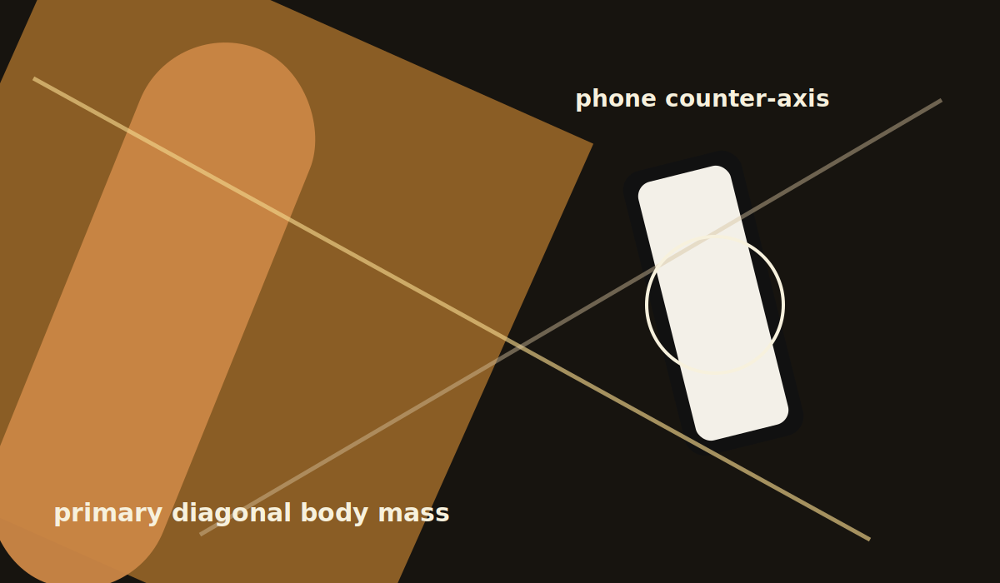
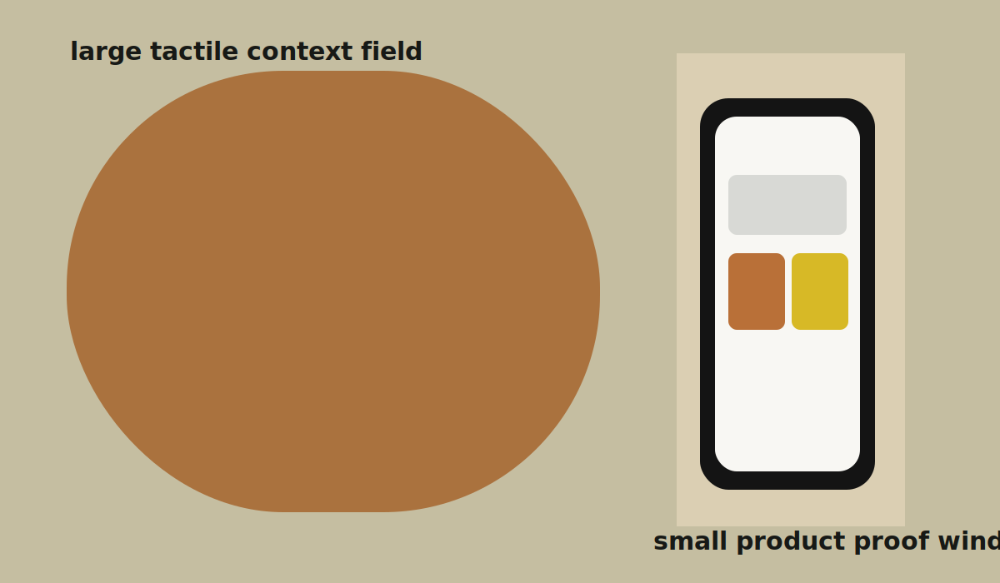

# Diagonal Over-Shoulder Product Frame

## Direct Evidence

E2 and E6 document the wide crop, diagonal body mass, and right-side phone placement.

## Evidence Provenance

| Ref | Method | Source Context | What It Proves | What It Does Not Prove | Confidence |
| --- | --- | --- | --- | --- | --- |
| E2 | image-observed | Full source image | Framing hierarchy and product placement | Exact camera rig | high |
| E6 | visual-estimated | Depth/occlusion | Foreground/background separation | Lens settings | medium |

## Interpretation

This is not a centered product frame. The app is made desirable by appearing inside a body-led, diagonal routine.

## Aesthetic Role

The frame feels active and intimate because the viewer is close to the subject and the product is slightly discovered, not presented.

## Technical Clues

Use wide aspect ratio, over-shoulder proximity, partial occlusion, and a right-side device placement.

## Reusable Recipe

Compose the body first, then place the device where the viewer naturally lands after following the diagonal.

## Contradictions / Lifecycle

No contradictions recorded.

## Extraction Notes

Exact camera height and lens are unavailable.
