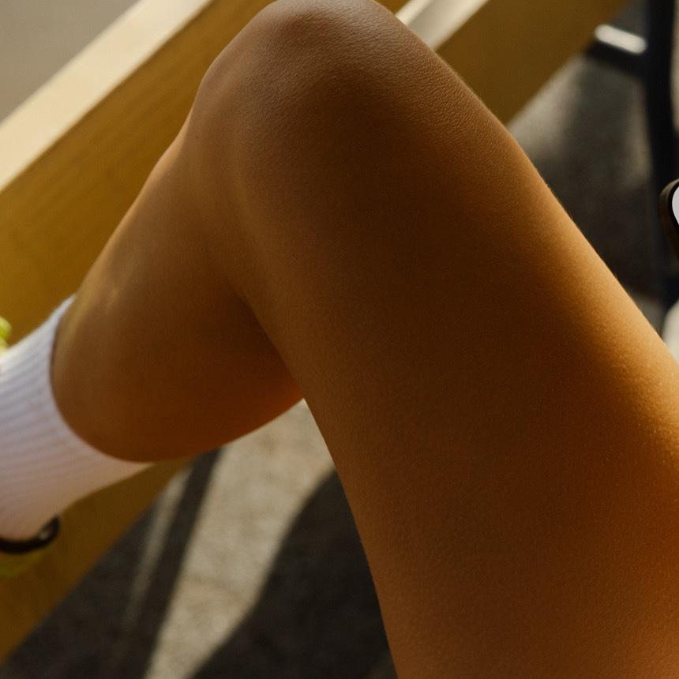

# Cropped Athlete Body As Context

## Direct Evidence

E3 documents the cropped body, hand, hair, and device grip.

## Evidence Provenance

| Ref | Method | Source Context | What It Proves | What It Does Not Prove | Confidence |
| --- | --- | --- | --- | --- | --- |
| E3 | image-observed | Subject area | In-use body staging | Identity or full activity context | high |

## Interpretation

The subject is not shown as a portrait. The image uses the body as a warm environment for the app.

## Aesthetic Role

The product feels close to a real moment: post-workout, meal planning, or casual recovery.

## Technical Clues

Crop hands, leg, hair, and shoulder aggressively enough that the subject becomes place and texture.

## Reusable Recipe

Use partial-body staging when the product benefit is routine-based and personal.

## Contradictions / Lifecycle

No contradictions recorded.

## Extraction Notes

Full pose and surrounding activity are unavailable.
