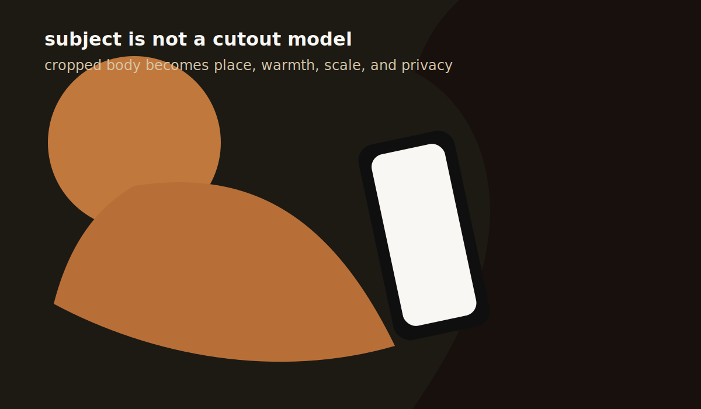
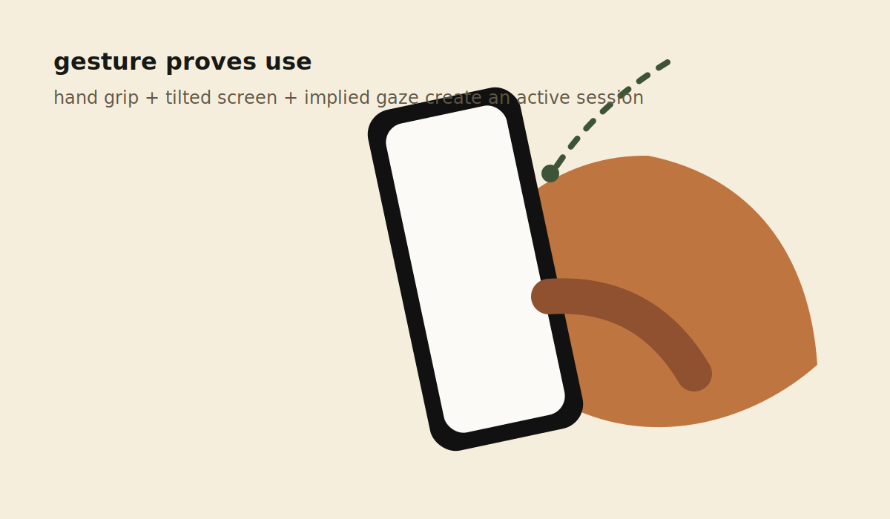
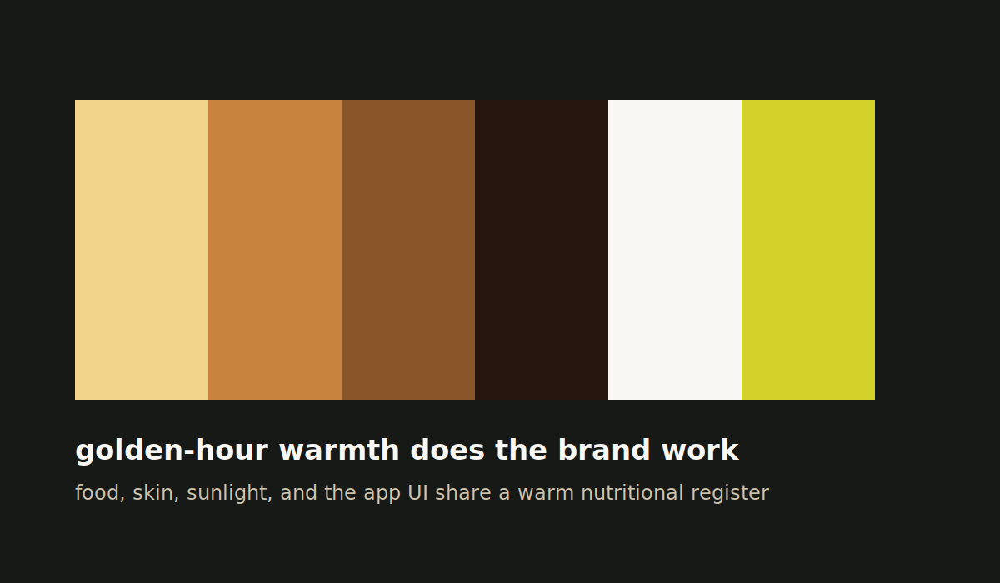
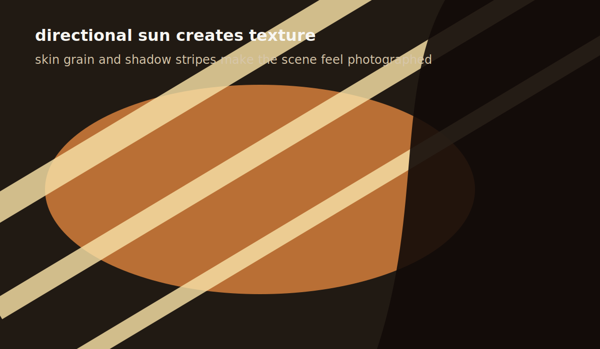
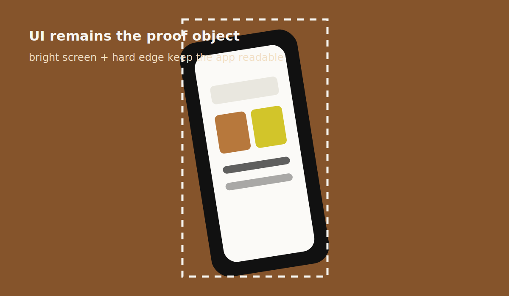
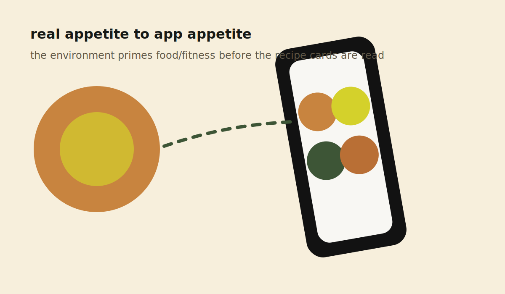

# Extract Report: Athleats iPhone Photography Style

## 1. Extract Summary

The image uses a lived-in product photography paradigm: a readable app screen is embedded inside warm athletic routine rather than isolated as a perfect device render. The strongest reusable ideas are the over-shoulder diagonal frame, cropped body-as-environment staging, warm hard sunlight, and a bright UI legibility window.

## 2. Source And Limits

- Source: `/Users/alexanderbeck/Desktop/69f4e8ec027c0f3a9feabb15_athleats-iphone-mockup-lg.jpg`
- Source type: image
- Source metadata: progressive JPEG, 6048 x 3144 px.
- Limits: EXIF camera/lens/exposure settings were not available through the inspected file info. Identity, location, and production setup are not known. Any camera/lens statements are inferred or visual-estimated, not verified.

## 3. System Readiness Check

The current project mostly supports this extraction because the extract skill explicitly covers images and asks for composition, palette, typography, subject treatment, texture, lighting, density, and style references. Two changes were needed:

- Added `photography-framing` and `subject-staging` to `workflow/category-catalogue.md` and `schemas/knowledge-node.schema.json`.
- Added `image-observed` to `schemas/extraction-report.schema.json` and `skills/extract/SKILL.md`.

## 4. Captured Still Assets

| Category | Image 1 | Image 2 | What They Show |
| --- | --- | --- | --- |
| photography-framing |  |  | Diagonal body axis, counter-diagonal phone placement, and product pushed into the right-side proof window. |
| subject-staging |  |  | Cropped body context and hand-held use gesture. |
| visual-style |  |  | Golden-hour palette, hard sunlight, and shadow texture. |
| media-handling |  |  | Phone UI as proof object and food/fitness context echoed between environment and recipe cards. |

## 5. Category Catalogue Findings

| Category | Finding | Evidence | Confidence |
| --- | --- | --- | --- |
| photography-framing | Product is framed through a diagonal over-shoulder/body field rather than centered. | E2, E6, S1, S2 | high |
| subject-staging | Cropped athlete body and hand-held phone make the app feel already in use. | E3, S3, S4 | high |
| visual-style | Warm hard sunlight and deep shadows connect athletic skin, appetite, and product mood. | E4, S5, S6 | high |
| media-handling | Bright phone UI remains readable as a proof window inside lifestyle photography. | E5, S7, S8 | high |

## 6. Evidence Table

| Evidence Ref | Method | Source URL/Path/Text Ref | Capture Context | Captured At | Media Path | Observation | What It Proves | What It Does Not Prove | Confidence |
| --- | --- | --- | --- | --- | --- | --- | --- | --- | --- |
| E1 | image-observed | Source JPEG | File inspection using `file` and `sips` | 2026-05-01 | `media/stills/athleats-iphone-photography-style/source-reference.jpg` | Source is a progressive JPEG, 6048 x 3144 px; reference copy is 1800 x 935 px. | Source type and dimensions. | Camera/lens/exposure metadata. | high |
| E2 | image-observed | Full image | Visual inspection | 2026-05-01 | `framing-diagonal-map.svg`, `framing-negative-space.svg` | Wide crop; body/leg runs diagonally through the frame; phone sits on right side at a counter angle. | Framing hierarchy and product placement. | Exact camera rig or intended grid. | high |
| E3 | image-observed | Subject area | Visual inspection | 2026-05-01 | `subject-body-as-environment.svg`, `subject-hand-phone-gesture.svg` | Person is partially cropped; hand grips phone; hair and body occlude frame edges. | Product is staged as in-use lifestyle, not isolated still life. | Identity or full activity context. | high |
| E4 | image-observed | Light/color | Visual inspection | 2026-05-01 | `visual-warm-grade-palette.svg`, `visual-light-shadow-bands.svg` | Warm amber light, skin texture, dark brown shadows, and bright sun/shadow bands dominate. | Color and lighting paradigm. | Exact grading LUT or light source. | high |
| E5 | image-observed | Phone screen | Visual inspection | 2026-05-01 | `media-screen-legibility.svg`, `media-lifestyle-ui-echo.svg` | Phone UI is bright and readable enough to see greeting, metrics, recipe cards, and bottom navigation. | Product remains a proof object inside the photo. | Full product behavior or screen implementation. | high |
| E6 | visual-estimated | Depth/occlusion | Visual inspection | 2026-05-01 | `source-reference.jpg` | Hair/foreground and background slats appear softer/darker than the phone and body. | Depth separation and occlusion strategy. | Exact aperture, focal length, or sensor size. | medium |

## 7. Aesthetic Rationale

The image feels intimate because the crop is physically close to the subject's body and hair, not because it shows an expressive face. It feels athletic because skin, limbs, and hard sunlight imply movement/rest in a training context. It feels product-relevant because the phone is still readable: the app is not hidden as a prop.

## 8. Technical Implementation Clues

- Frame wide and close, with the phone placed off-center.
- Let the body or limb become a large warm shape that controls the composition.
- Crop subject edges aggressively to avoid portrait literalness.
- Preserve a clean highlight path onto the phone screen.
- Use warm direct light and deep shadow to create texture and lifestyle credibility.
- Keep the phone UI bright and high contrast so the product is legible even at a tilt.

## 9. Reusable Recipes

### R1 Diagonal Over-Shoulder Product Frame

Place the camera above/behind the subject. Use a large diagonal body shape as the main field. Place the device on the right or lower-right, angled against the body diagonal. Keep the device readable but secondary.

### R2 Body-As-Environment Subject Staging

Crop the subject so the person becomes context: leg, hand, shoulder, hair, or torso. Avoid a full portrait. Let the hand/device relationship prove use.

### R3 Warm Athletic Lifestyle Grade

Use warm amber highlights, brown/black shadow pools, visible skin texture, and small bright color accents. Keep the grade appetizing, not clinical.

### R4 UI Proof Window In Lifestyle Scene

Keep product UI bright, large enough to read, and free from heavy reflection. The phone screen should explain what the product does while the rest of the photograph explains when and why it matters.

## 10. Reuse Readiness Gate

| Recipe | Status | Can Another Agent Recreate It Without Reopening Source? | Missing Evidence / Blocker |
| --- | --- | --- | --- |
| diagonal-over-shoulder-product-frame | pass | yes | Exact lens and camera height unavailable. |
| body-as-environment-subject-staging | pass | yes | Full subject pose outside crop unavailable. |
| warm-athletic-lifestyle-grade | pass | yes | Exact color grade pipeline unavailable. |
| ui-proof-window-in-lifestyle-scene | pass | yes | Screen reflections and capture setup unavailable. |

## 11. Knowledge Nodes

- `athleats-iphone-photography-style`: `knowledge/sources/athleats-iphone-photography-style/source.md`
- `diagonal-over-shoulder-product-frame`: `knowledge/findings/photography-framing/diagonal-over-shoulder-product-frame.md`
- `cropped-athlete-body-as-context`: `knowledge/findings/subject-staging/cropped-athlete-body-as-context.md`
- `golden-hour-athletic-lifestyle-grade`: `knowledge/findings/visual-style/golden-hour-athletic-lifestyle-grade.md`
- `legible-phone-ui-in-lifestyle-scene`: `knowledge/findings/media-handling/legible-phone-ui-in-lifestyle-scene.md`
- `lived-in-product-photography-frame`: `knowledge/patterns/reusable-principles/lived-in-product-photography-frame.md`

## 12. Brain Links

- `athleats-iphone-photography-style` -> four findings: evidenced-by
- Four findings -> `lived-in-product-photography-frame`: supports
- `lived-in-product-photography-frame` -> `non-flickering-recipe-card-hover`: inspired-by

## 13. Open Questions

- Camera body, lens, aperture, focal length, shutter, ISO, and color grade are not available.
- Whether the image is fully photographic, composited, or partially generated is not verified.
- The exact app screen implementation is not inspected from this image alone.
