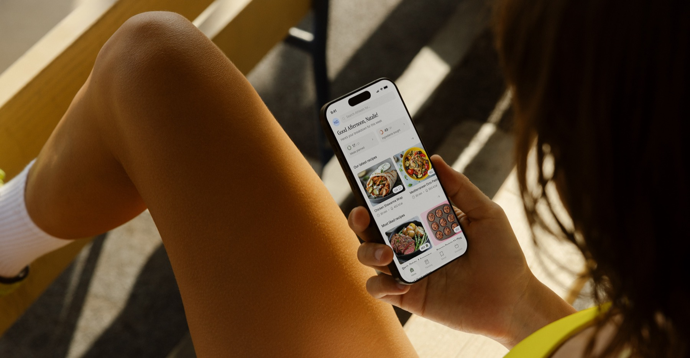

# Athleats iPhone Photography Style

## Direct Evidence

The image is a progressive JPEG, 6048 x 3144 px, supplied from the user's desktop. A lightweight reference copy is stored at:

## System Readiness Check

The project already supported image extraction at the workflow level, but two gaps showed up:

- The category catalogue did not name photography-specific framing or subject staging.
- The extraction-report schema did not include an `image-observed` method.

Both were added so future image extracts do not have to hide photographic observations under website-oriented categories.

## Evidence Provenance

| Ref | Method | Source Context | What It Proves | What It Does Not Prove | Confidence |
| --- | --- | --- | --- | --- | --- |
| E1 | image-observed | Source JPEG metadata and visual inspection | Source dimensions and image type | Camera body, lens, or exposure settings | high |
| E2 | image-observed | Full image composition | Wide oblique over-shoulder crop with phone on right side | Photographer's exact intent | high |
| E3 | image-observed | Subject/body placement | Cropped body and hand create lifestyle context around device | Identity or activity immediately before/after capture | high |
| E4 | image-observed | Light and color | Warm directional sunlight, deep brown shadows, and high skin texture | Exact grading LUT or post-production pipeline | high |
| E5 | image-observed | Device area | Phone screen remains readable enough to show app greeting and recipe cards | Full UI implementation details | high |
| E6 | visual-estimated | Depth and occlusion | Hair/foreground and background slats are softer/darker than phone and body | Exact aperture/focal length | medium |

## Interpretation

The image borrows from documentary lifestyle photography rather than clean product rendering. The phone is important, but it is not allowed to dominate the image; the body and light establish routine, warmth, and athletic proximity first.

## Aesthetic Role

The frame feels personal because the viewer appears to be close to the user's body and shoulder. It feels active because all dominant shapes run diagonally. It feels food/fitness-specific because the warm grade connects skin, sunlight, and the colorful recipe cards on the screen.

## Technical Clues

- Camera position: inferred oblique top/over-shoulder angle.
- Crop: verified wide 6048 x 3144 source; compressed reference stored at 1800 x 935.
- Subject hierarchy: body texture dominates, phone is secondary but sharp/readable.
- Light: strong warm sunlight and shadow bands; likely natural direct sun or hard warm source.
- Product treatment: white phone UI creates a high-contrast legibility window inside warm surroundings.

## Reusable Recipe

Use this pattern when app photography should feel lived-in:

1. Put the device into a real hand/body routine rather than on a clean surface.
2. Crop the person partially so the subject becomes environment, not portrait.
3. Keep the product readable but not centered.
4. Use diagonal limb/prop lines to imply motion or rest-after-motion.
5. Let warm light and shadow texture carry the brand mood.

## Contradictions / Lifecycle

No contradictions recorded.

## Extraction Notes

The analysis does not claim exact camera/lens settings. Those are not available from the supplied file metadata.
