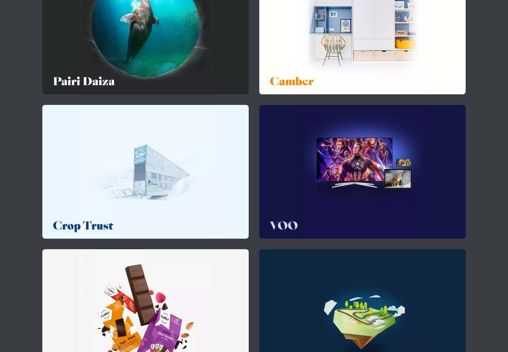

# Extract Report: EPIC Work Line Portfolio Index

## 1. Extract Summary

The capture verified a strong editorial work index: dark page field, thin rules, category filters with counts, and large two-column case cards. The embedded video/3D area did not verify in this environment.

## 2. Source And Limits

- Source: https://www.epic.net/en/work/
- Source type: website
- Limits: The hero video area showed a connection verification failure. Hover, menu, video, and line-effect behavior need follow-up capture.

## 3. Captured Moments

| Moment | Category | Media | Why It Matters | Confidence |
| --- | --- | --- | --- | --- |
| M1 | layout-grid-composition |  | Shows the reusable card grid and visual taxonomy surface. | high |

## 4. Category Catalogue Findings

| Category | Finding | Evidence | Confidence |
| --- | --- | --- | --- |
| layout-grid-composition | Case cards are large and visual, arranged as a gallery-like two-column grid. | E2 | high |
| scroll-navigation | Category filters with counts create a clear work-browsing surface. | E1 | medium |
| media-handling | Hero video could not be verified in this capture environment. | E4 | high |

## 5. Evidence Table

| Evidence Ref | Method | Source URL/Path/Text Ref | Capture Context | Captured At | Media Path | Observation | What It Proves | What It Does Not Prove | Confidence |
| --- | --- | --- | --- | --- | --- | --- | --- | --- | --- |
| E1 | screenshot-observed | https://www.epic.net/en/work/ | Desktop first viewport | 2026-05-02 | media/stills/epic-work-line-portfolio-index/work-desktop.png | Header, rule, video region, and filter row are visible. | Page structure and taxonomy placement. | Video content. | high |
| E2 | screenshot-observed | full-page crop | Desktop lower grid | 2026-05-02 | media/stills/epic-work-line-portfolio-index/case-grid-desktop.png | Large two-column case-study cards with expressive titles. | Card-grid pattern. | Hover states. | high |
| E3 | text-derived | page HTML | Node fetch metadata | 2026-05-02 | not available | Assets include Works, Video, and CaseCard bundles. | Implementation surface clues. | Source internals. | medium |
| E4 | browser-observed | embedded video area | Desktop capture | 2026-05-02 | media/stills/epic-work-line-portfolio-index/work-desktop.png | Player reported that connection privacy could not be verified. | Capture limitation. | Normal-user playback. | high |

## 6. Interaction And Sensory Decomposition

| Interaction | Trigger | User Intent | Pre-State | Feedback | Transition | Settled State | Edge States | Feel | Evidence | Confidence |
| --- | --- | --- | --- | --- | --- | --- | --- | --- | --- | --- |
| Work filtering | category selection | Narrow project set | All/highlights visible | Active pill/rule state visible | not inspected | Filtered grid expected | Not tested | curated, formal | E1 | medium |

## 7. Aesthetic Rationale

The page feels like an awards catalogue because the filters, rules, and cards share the same formal visual language.

## 8. Technical Implementation Clues

The HTML references `Works`, `Video`, and `CaseCard` bundles. Exact grid CSS, hover states, and motion effects were not inspected.

## 9. Reusable Recipes

Frame the archive with an editorial shell. Give filters visible counts. Use large image cards so the index does not become a text database.

## 10. Reuse Readiness Gate

| Recipe | Status | Can Another Agent Recreate It Without Reopening Source? | Missing Evidence / Blocker |
| --- | --- | --- | --- |
| editorial-filtered-work-index | pass | yes | Video/3D effects not captured. |

## 11. Knowledge Nodes

- epic-work-line-portfolio-index: knowledge/sources/epic-work-line-portfolio-index/source.md
- editorial-filtered-work-index: knowledge/patterns/reusable-principles/editorial-filtered-work-index.md

## 12. Brain Links

- epic-work-line-portfolio-index -> editorial-filtered-work-index: example-of

## 13. Open Questions

- Can a headed browser or different network path verify the video, line, and 3D effects?
