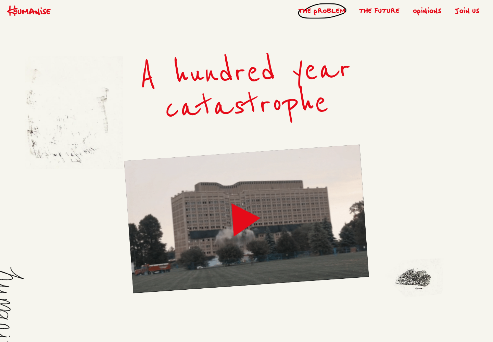

# Extract Report: Humanise Problem Storytelling

## 1. Extract Summary

Humanise uses handwritten red type, rough marks, a paper-like background, and tilted media to make an architecture critique feel personal and urgent.

## 2. Source And Limits

- Source: https://humanise.org/the-problem
- Source type: website
- Limits: Stills captured on desktop and mobile. Video playback and scroll/motion timing were not inspected.

## 3. Captured Moments

| Moment | Category | Media | Why It Matters | Confidence |
| --- | --- | --- | --- | --- |
| M1 | typography |  | Shows red handwriting, rough texture, and tilted media. | high |

## 4. Category Catalogue Findings

| Category | Finding | Evidence | Confidence |
| --- | --- | --- | --- |
| typography | Handwritten red type carries both navigation and headline voice. | E1 | high |
| visual-style | Rough marks and off-white background reject sterile polish. | E1 | high |
| media-handling | Tilted media gives the hero a collage-like editorial feel. | E1 | high |

## 5. Evidence Table

| Evidence Ref | Method | Source URL/Path/Text Ref | Capture Context | Captured At | Media Path | Observation | What It Proves | What It Does Not Prove | Confidence |
| --- | --- | --- | --- | --- | --- | --- | --- | --- | --- |
| E1 | screenshot-observed | https://humanise.org/the-problem | Desktop first viewport | 2026-05-02 | media/stills/humanise-problem-storytelling/problem-desktop.png | Red handwriting, off-white field, tilted media card, rough marks. | Campaign visual rhetoric. | Font source. | high |
| E2 | screenshot-observed | full-page crop | Desktop lower section | 2026-05-02 | media/stills/humanise-problem-storytelling/problem-copy-section-desktop.png | Rough editorial treatment continues below hero. | System continuity. | Full narrative sequence. | medium |
| E3 | screenshot-observed | mobile capture | Mobile 390x844 | 2026-05-02 | media/stills/humanise-problem-storytelling/mobile-problem.png | Mobile preserves handwritten campaign identity. | Responsive continuity. | All breakpoints. | medium |
| E4 | text-derived | page HTML | Node fetch metadata | 2026-05-02 | not available | Metadata frames the site as a campaign to end boring buildings. | Source positioning. | Internal components. | medium |

## 6. Interaction And Sensory Decomposition

| Interaction | Trigger | User Intent | Pre-State | Feedback | Transition | Settled State | Edge States | Feel | Evidence | Confidence |
| --- | --- | --- | --- | --- | --- | --- | --- | --- | --- | --- |
| Campaign read | first viewport | Understand the problem | Off-white page field | Handwritten headline and video card pull attention | not inspected | User can play/read/scroll | Video not inspected | urgent, human, anti-corporate | E1 | high |

## 7. Aesthetic Rationale

The page argues against boring buildings by visually refusing sterile precision. The handwriting gives the critique a human hand.

## 8. Technical Implementation Clues

The page ships compact `index` JS/CSS assets. Exact font files, animation, and video behavior were not inspected.

## 9. Reusable Recipes

Use roughness as voice, not as layout chaos: handwriting for claims, tilted media for energy, and clean spacing for comprehension.

## 10. Reuse Readiness Gate

| Recipe | Status | Can Another Agent Recreate It Without Reopening Source? | Missing Evidence / Blocker |
| --- | --- | --- | --- |
| handwritten-campaign-collage-page | pass | yes | Exact font and motion details unavailable. |

## 11. Knowledge Nodes

- humanise-problem-storytelling: knowledge/sources/humanise-problem-storytelling/source.md
- handwritten-campaign-collage-page: knowledge/patterns/reusable-principles/handwritten-campaign-collage-page.md

## 12. Brain Links

- humanise-problem-storytelling -> handwritten-campaign-collage-page: example-of

## 13. Open Questions

- What happens when the hero video is played?
