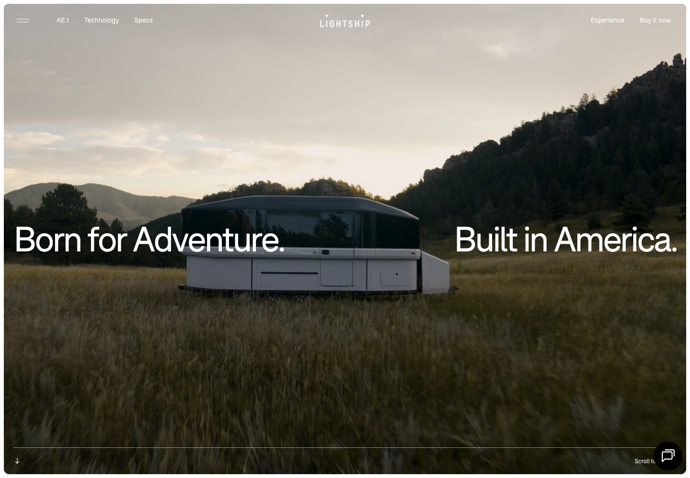

# Extract Report: Lightship RV Product Parallax

## 1. Extract Summary

Lightship's first viewport is a cinematic product scene: full-bleed landscape media, the RV centered in the environment, large split headline text, minimal overlaid navigation, and a quiet scroll cue.

## 2. Source And Limits

- Source: https://lightshiprv.com/
- Source type: website
- Limits: Stills captured. The parallax/3D claim is only partially verified because motion capture and JS inspection were not completed.

## 3. Captured Moments

| Moment | Category | Media | Why It Matters | Confidence |
| --- | --- | --- | --- | --- |
| M1 | media-handling |  | Shows the product embedded in a full-bleed scene with split headline text. | high |

## 4. Category Catalogue Findings

| Category | Finding | Evidence | Confidence |
| --- | --- | --- | --- |
| media-handling | The product is shown in-situ, not isolated. | E1 | high |
| typography | Split headline wraps around the product scene. | E1 | high |
| scroll-navigation | A bottom rule and scroll cue frame the scene as a guided story. | E1 | medium |

## 5. Evidence Table

| Evidence Ref | Method | Source URL/Path/Text Ref | Capture Context | Captured At | Media Path | Observation | What It Proves | What It Does Not Prove | Confidence |
| --- | --- | --- | --- | --- | --- | --- | --- | --- | --- |
| E1 | screenshot-observed | https://lightshiprv.com/ | Desktop first viewport | 2026-05-02 | media/stills/lightshiprv-product-parallax/home-desktop.png | Full-bleed landscape/product hero with split headline. | Cinematic scene composition. | Parallax timing. | high |
| E2 | screenshot-observed | full-page crop | Desktop lower section | 2026-05-02 | media/stills/lightshiprv-product-parallax/spec-transition-desktop.png | Product/spec sections continue below. | Story continuation. | Exact scroll mechanics. | medium |
| E3 | screenshot-observed | mobile capture | Mobile 390x844 | 2026-05-02 | media/stills/lightshiprv-product-parallax/mobile-home.png | Mobile keeps product-first cinematic framing. | Responsive continuity. | Full mobile sequence. | medium |
| E4 | text-derived | page HTML | Node fetch metadata | 2026-05-02 | not available | Metadata identifies Lightship as an all-electric RV company. | Product positioning. | Source internals. | high |

## 6. Interaction And Sensory Decomposition

| Interaction | Trigger | User Intent | Pre-State | Feedback | Transition | Settled State | Edge States | Feel | Evidence | Confidence |
| --- | --- | --- | --- | --- | --- | --- | --- | --- | --- | --- |
| Cinematic entry | page load | Understand product promise | Full-bleed scene starts immediately | Product, headline, nav, and scroll cue appear together | not inspected | User scrolls into product story | Parallax not recorded | premium, spacious, outdoor | E1 | high |

## 7. Aesthetic Rationale

The product feels desirable because it is already in an adventure setting. The typography sits in the same world as the media, rather than in a separate marketing card.

## 8. Technical Implementation Clues

HTML references `assets/styles/main.css` and `assets/scripts/app.js`. Exact media playback, parallax, and easing values are not verified.

## 9. Reusable Recipes

Use full-viewport product media, split typography, and minimal chrome. Let the environment do part of the selling.

## 10. Reuse Readiness Gate

| Recipe | Status | Can Another Agent Recreate It Without Reopening Source? | Missing Evidence / Blocker |
| --- | --- | --- | --- |
| cinematic-product-scene-hero | pass | yes | Parallax mechanics unavailable. |

## 11. Knowledge Nodes

- lightshiprv-product-parallax: knowledge/sources/lightshiprv-product-parallax/source.md
- cinematic-product-scene-hero: knowledge/patterns/reusable-principles/cinematic-product-scene-hero.md

## 12. Brain Links

- lightshiprv-product-parallax -> cinematic-product-scene-hero: example-of

## 13. Open Questions

- What exact scroll-linked transforms or 3D layers drive the later sections?
