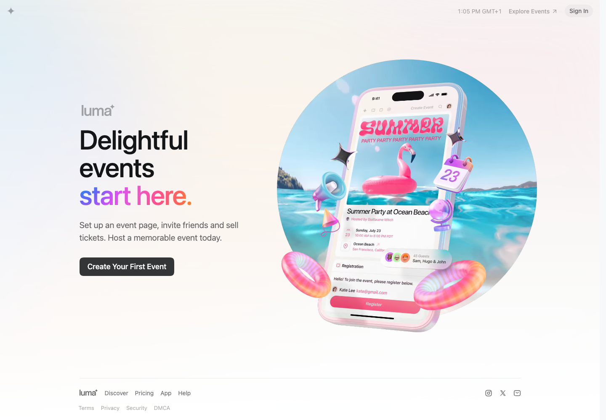

# Extract Report: Luma Event Discovery System

## 1. Extract Summary

Luma's homepage hero combines a simple text/CTA column with a large, legible product mockup inside a playful event scene.

## 2. Source And Limits

- Source: https://luma.com/
- Source type: website
- Limits: The public homepage was captured. Logged-in creation flows, event discovery pages, and animation internals were not inspected.

## 3. Captured Moments

| Moment | Category | Media | Why It Matters | Confidence |
| --- | --- | --- | --- | --- |
| M1 | visual-style |  | Shows the readable product UI embedded in a playful event scene. | high |

## 4. Category Catalogue Findings

| Category | Finding | Evidence | Confidence |
| --- | --- | --- | --- |
| media-handling | The phone UI remains readable inside the hero scene. | E1 | high |
| visual-style | Floating props communicate event mood without replacing product proof. | E1 | high |
| performance-responsiveness | Mobile still preserves the product-scene idea. | E2 | medium |

## 5. Evidence Table

| Evidence Ref | Method | Source URL/Path/Text Ref | Capture Context | Captured At | Media Path | Observation | What It Proves | What It Does Not Prove | Confidence |
| --- | --- | --- | --- | --- | --- | --- | --- | --- | --- |
| E1 | screenshot-observed | https://luma.com/ | Desktop 1440x1000 | 2026-05-02 | media/stills/luma-event-discovery-system/home-desktop.png | Product mockup sits inside a circular event scene with floating props. | Product-scene composition. | Asset production method. | high |
| E2 | screenshot-observed | https://luma.com/ | Mobile 390x844 | 2026-05-02 | media/stills/luma-event-discovery-system/mobile-home.png | Mobile adapts the same hero idea. | Responsive continuity. | All breakpoints. | medium |
| E3 | text-derived | page HTML | Node fetch metadata | 2026-05-02 | not available | Metadata describes event hosting, tickets, and discovery. | Product positioning. | Internal IA. | high |

## 6. Interaction And Sensory Decomposition

| Interaction | Trigger | User Intent | Pre-State | Feedback | Transition | Settled State | Edge States | Feel | Evidence | Confidence |
| --- | --- | --- | --- | --- | --- | --- | --- | --- | --- | --- |
| Product proof read | first viewport | Understand what Luma makes | Simple copy column | Phone UI and event props give context | not inspected | CTA remains available | Animation unavailable | friendly, celebratory | E1 | high |

## 7. Aesthetic Rationale

The page feels delightful because the event is represented as a social scene, not just as dashboard UI. The product still remains inspectable.

## 8. Technical Implementation Clues

The site uses Next.js static chunks. Exact image formats, object layering, and animation behavior were not inspected.

## 9. Reusable Recipes

Use contextual props to explain the feeling of the use case while preserving product UI legibility.

## 10. Reuse Readiness Gate

| Recipe | Status | Can Another Agent Recreate It Without Reopening Source? | Missing Evidence / Blocker |
| --- | --- | --- | --- |
| legible-ui-in-playful-product-orbit | pass | yes | Exact asset pipeline unavailable. |

## 11. Knowledge Nodes

- luma-event-discovery-system: knowledge/sources/luma-event-discovery-system/source.md
- legible-ui-in-playful-product-orbit: knowledge/patterns/reusable-principles/legible-ui-in-playful-product-orbit.md

## 12. Brain Links

- luma-event-discovery-system -> legible-ui-in-playful-product-orbit: example-of

## 13. Open Questions

- How do event pages and discovery pages extend this visual language?
