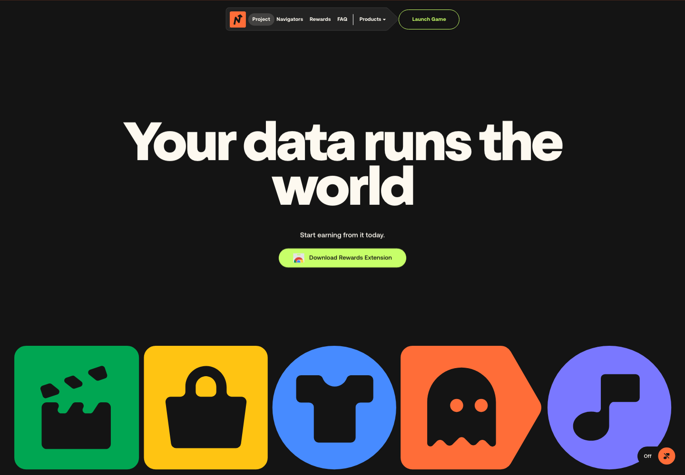

# Extract Report: NVG8 Animated Navigation System

## 1. Extract Summary

The reusable value is an abstract-product landing hero that uses game-like scale and color: huge centered type, one neon CTA, compact top chrome, and oversized symbolic tiles cropped by the viewport.

## 2. Source And Limits

- Source: https://nvg8.io
- Source type: website
- Limits: Desktop and mobile stills captured. Motion timing, easing, hover states, and scroll choreography were not recorded in this pass.

## 3. Captured Moments

| Moment | Category | Media | Why It Matters | Confidence |
| --- | --- | --- | --- | --- |
| M1 | visual-style |  | Shows the black stage, oversized headline, neon CTA, and cropped icon tiles. | high |

## 4. Category Catalogue Findings

| Category | Finding | Evidence | Confidence |
| --- | --- | --- | --- |
| visual-style | Bright toy-like icons make an abstract data product feel game-like. | E1 | high |
| layout-grid-composition | The first viewport keeps navigation compact so the icon strip becomes the main personality layer. | E1 | medium |
| performance-responsiveness | Mobile still preserves the dark stage and simplified hero composition. | E2 | medium |

## 5. Evidence Table

| Evidence Ref | Method | Source URL/Path/Text Ref | Capture Context | Captured At | Media Path | Observation | What It Proves | What It Does Not Prove | Confidence |
| --- | --- | --- | --- | --- | --- | --- | --- | --- | --- |
| E1 | screenshot-observed | https://nvg8.io | Desktop 1440x1000 | 2026-05-02 | media/stills/nvg8-animated-navigation-system/home-desktop.png | Black hero, huge headline, green CTA, colorful icon tiles. | First-viewport visual system. | Animation timing. | high |
| E2 | screenshot-observed | https://nvg8.io | Mobile 390x844 | 2026-05-02 | media/stills/nvg8-animated-navigation-system/mobile-home.png | Mobile keeps the dark, high-contrast product framing. | Responsive preservation of concept. | Full touch behavior. | medium |
| E3 | text-derived | page HTML | Node fetch metadata | 2026-05-02 | not available | Title is Navigate; assets include Nuxt files and scroll-trigger naming. | Framework/asset clue. | Original component structure. | medium |

## 6. Interaction And Sensory Decomposition

| Interaction | Trigger | User Intent | Pre-State | Feedback | Transition | Settled State | Edge States | Feel | Evidence | Confidence |
| --- | --- | --- | --- | --- | --- | --- | --- | --- | --- | --- |
| Hero read | page load | Understand product promise | Black empty-feeling stage | Huge claim and icon toys anchor attention | not inspected | CTA and icon strip remain visible | Motion unavailable | energetic, game-like | E1 | medium |

## 7. Aesthetic Rationale

The hero feels animated even as a still because the symbols are too large to sit politely inside the viewport. Their crop implies motion and continuation.

## 8. Technical Implementation Clues

Use a dark background, oversized headline, a single bright CTA, and large icon tiles. Nuxt asset paths were observed. Exact animations are not verified.

## 9. Reusable Recipes

Create a product hero with one sentence of positioning and a bottom strip of symbolic tiles. Avoid explanatory feature cards in the first viewport.

## 10. Reuse Readiness Gate

| Recipe | Status | Can Another Agent Recreate It Without Reopening Source? | Missing Evidence / Blocker |
| --- | --- | --- | --- |
| oversized-icon-strip-landing | pass | yes | Exact motion tokens unavailable. |

## 11. Knowledge Nodes

- nvg8-animated-navigation-system: knowledge/sources/nvg8-animated-navigation-system/source.md
- oversized-icon-strip-landing: knowledge/patterns/reusable-principles/oversized-icon-strip-landing.md

## 12. Brain Links

- nvg8-animated-navigation-system -> oversized-icon-strip-landing: example-of

## 13. Open Questions

- What are the actual tile animation timing and easing values?
