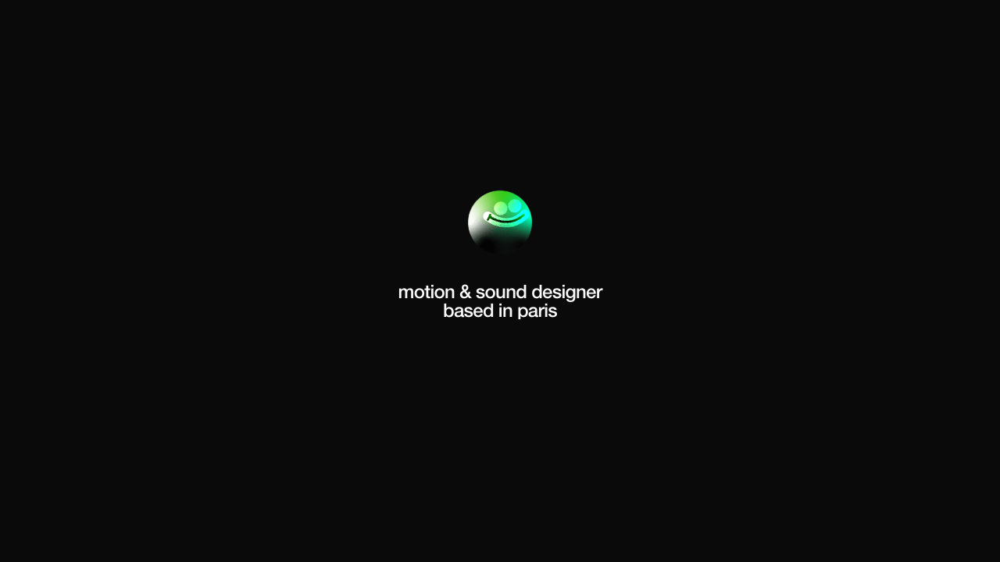
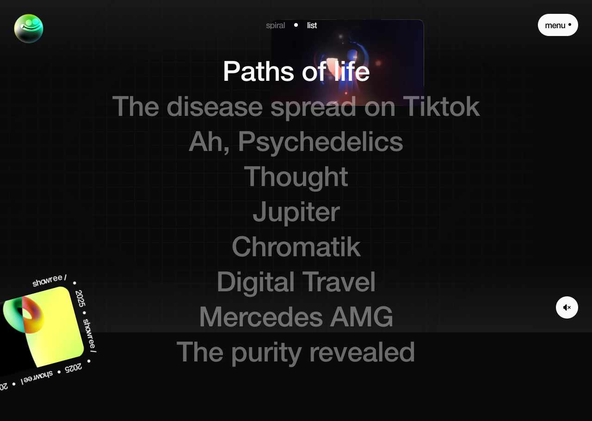
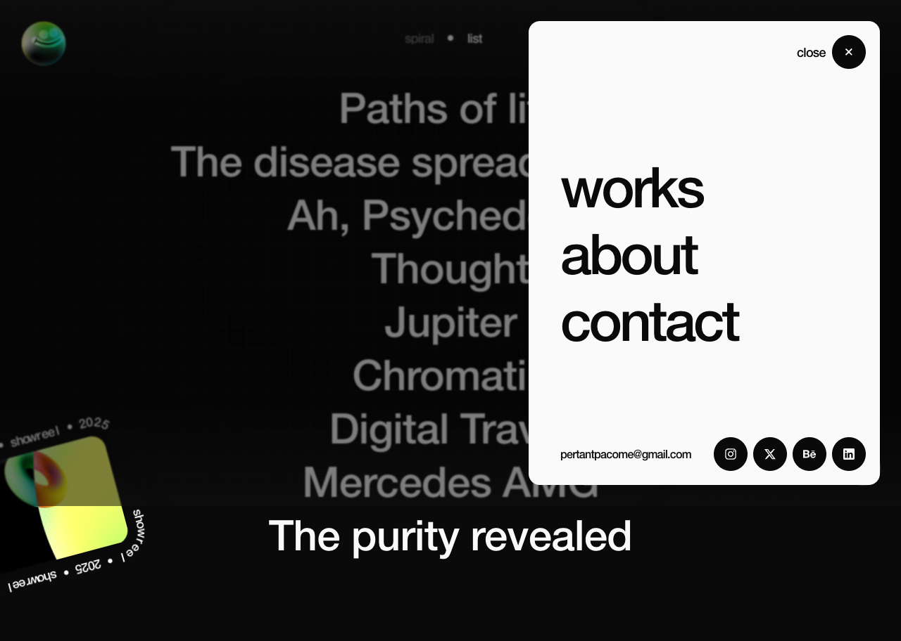
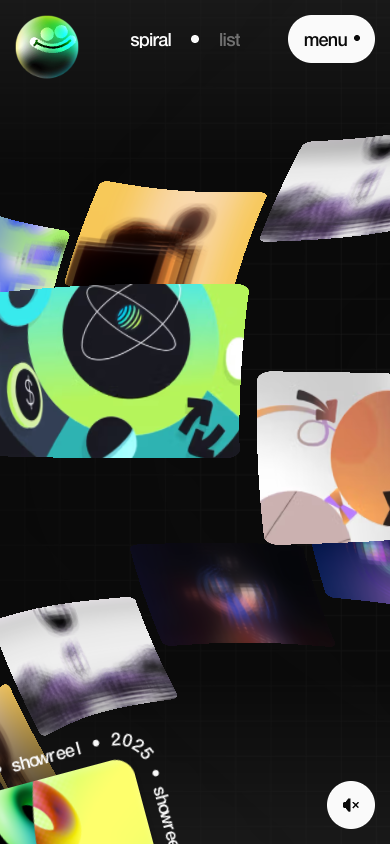
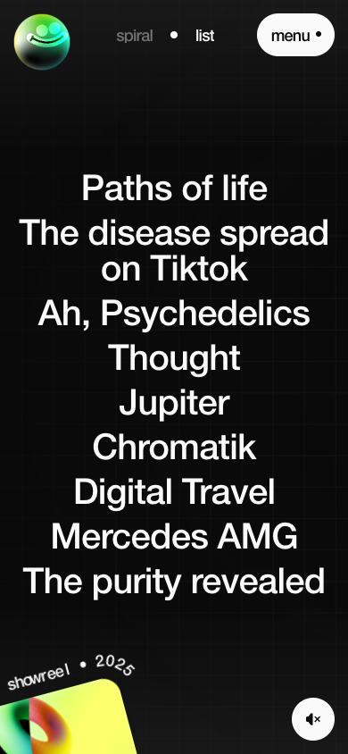
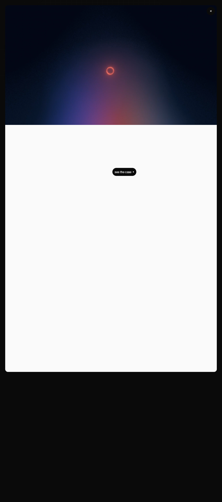

# Extract Report: Pacome Pertant Portfolio

## 1. Extract Summary

Pacome Pertant's portfolio feels satisfying because it treats the project index as a playable instrument rather than a static gallery. The durable pattern is a dark, high-contrast portfolio shell with fixed controls, optional sound, a WebGL project constellation, a fallback list mode, image-backed hover feedback, and project pages that keep the user inside a continuous next-up loop.

The strongest reusable principles are:

- Make entry intentional: gate the experience with an explicit sound choice and then slide the loader away.
- Keep navigation chrome stable: fixed logo, mode switch, menu, showreel, and sound controls reduce disorientation while the center changes.
- Pair playful motion with a reliable list fallback: the WebGL spiral creates curiosity; the list mode restores scannability.
- Use hover as proof of content: a large preview appears behind the hovered list title and siblings dim.
- Turn project details into a sequence: the first project page ends with a "next up" card, keeping the portfolio rhythm continuous.

## 2. Source And Limits

- Source: `https://pacomepertant.com`
- Source type: website
- Capture date: 2026-05-01
- Capture tools: Playwright CLI, browser snapshots, screenshots, video recordings, DOM evaluation, CSS/network inspection, console inspection.
- Desktop viewport: 1280 x 720.
- Mobile viewport: 390 x 844.
- Audio limit: named audio files and sound-toggle behavior were verified, but audible playback could not be directly heard or waveform-tested in browser automation.
- WebGL limit: canvas presence, size, visual output, and interaction response were verified; shader internals and exact 3D camera math were not inspected.
- Timing limit: CSS timing values are verified where derived from stylesheets; video-observed timings are estimated unless tied to CSS.
- Reduced motion: no `prefers-reduced-motion` CSS rule was found in inspected CSS text; JS fallback behavior for reduced motion was not fully audited.

## 3. Captured Moments

| Moment | Category | Media | Why It Matters | Confidence |
| --- | --- | --- | --- | --- |
| M1 | loading-entry |  | Shows the explicit no-sound entry path and the loader-to-index transition. | medium |
| M2 | background-webgl-canvas-svg |  | Shows the mode switch from playful WebGL project constellation to readable list. | medium |
| M3 | hover-touch-feedback |  | Shows title hover preview behavior and sibling dimming. | medium |
| M4 | motion-choreography |  | Shows the expanding pill menu and close return. | medium |
| M5 | sound-interaction-audio |  | Shows the fixed sound control toggling visual state. | low |
| M6 | performance-responsiveness |  | Shows the cropped mobile spiral and no normal document scroll on the home canvas state. | medium |
| M7 | project-sequencing |  | Shows a list item opening into a project detail page. | medium |
| M8 | project-sequencing |  | Shows project-page scroll into styleframes and next-up sequencing. | medium |

Still frames:

- 
- 
- 
- 
- 
- 

## 4. Category Catalogue Findings

| Category | Finding | Evidence | Confidence |
| --- | --- | --- | --- |
| loading-entry | The site asks the visitor to choose sound before entering, making audio consent part of the aesthetic ritual. | E1, E2, M1 | high |
| sound-interaction-audio | The site preloads/requests many named `.ogg` sounds for hover, click, mode switching, menu links, ambient audio, and smiley/logo interactions. | E6, E7 | medium |
| background-webgl-canvas-svg | The default work index is rendered through a full-viewport fixed canvas with warped project thumbnails arranged as a spiral/constellation. | E3, E4, M2 | high |
| hover-touch-feedback | In list mode, hovering a project title keeps the active title bright, dims siblings, and shows a large thumbnail behind the title. | E8, E9, M3 | high |
| motion-choreography | Fixed chrome uses short fades and spring-like transitions; the menu expands from a small pill into a panel using 0.8-1s spring timings. | E10, E11, M4 | high |
| layout-grid-composition | The interface uses a black grid field, fixed corner controls, centered mode switch, lower-left showreel, and lower-right sound button. | E3, E12 | high |
| project-sequencing | Project pages keep users moving with scrollable styleframes and a "next up" card for the next project. | E13, E14, M8 | high |
| media-handling | Content is driven by Nuxt payload data, Sanity images, Mux video metadata, and optimized image URLs using width and auto-format parameters. | E5, E15 | high |
| performance-responsiveness | The mobile work state keeps the same chrome but crops the spiral into a touch-first viewport; list mode becomes a compact centered vertical stack. | E16, E17, M6 | medium |

## 5. Evidence Table

| Evidence Ref | Method | Source URL/Path/Text Ref | Capture Context | Captured At | Media Path | Observation | What It Proves | What It Does Not Prove | Confidence |
| --- | --- | --- | --- | --- | --- | --- | --- | --- | --- |
| E1 | browser-observed | `https://pacomepertant.com/` | Desktop 1280 x 720, first load after clearing browser data | 2026-05-01 | `media/stills/pacomepertant-portfolio/entry-gate-desktop.png` | Entry screen shows "motion & sound designer based in paris", "enter with sound", and "enter without sound". | Entry requires an explicit sound choice before the main work index. | Does not prove whether sound successfully plays. | high |
| E2 | css-derived | `/_nuxt/index.D4O3qLO1.css` | CSS inspection | 2026-05-01 | not available | Loader uses fixed full-screen dark background, `transition: transform .5s var(--ease-quad-in-out)`, and no-sound opacity/translate transitions of `.3s`. | The entry exit and button reveal timing are CSS-defined. | Does not prove runtime loading duration. | high |
| E3 | screenshot-observed | `https://pacomepertant.com/` | Desktop work index after no-sound entry, 1280 x 720 | 2026-05-01 | `media/stills/pacomepertant-portfolio/work-list-desktop.png` | Default work state shows floating distorted project thumbnails over a dark grid with fixed logo, mode switch, menu, showreel, and sound controls. | The primary index is visually spatial and playful, not a conventional grid. | Does not reveal shader implementation. | high |
| E4 | dom-derived | `https://pacomepertant.com/` | Desktop DOM evaluation after no-sound entry | 2026-05-01 | not available | `canvas.webgl` exists at 1280 x 720; `documentElement.className` includes `lenis`; document scroll height was 720 on the home canvas state. | The spiral state is canvas-backed and viewport-contained. | Does not identify the WebGL library or shader code. | high |
| E5 | network-derived | `/_payload.json` | Payload inspection | 2026-05-01 | not available | Payload includes 9 projects, project titles/slugs/descriptions, Sanity image refs, Mux playback IDs, showreel metadata, email, and social links. | The content model is data-driven rather than hardcoded only in DOM text. | Does not prove CMS editing workflow. | high |
| E6 | network-derived | Browser requests | Desktop after entering site | 2026-05-01 | not available | Requests include `ambient.ogg`, `hover.ogg`, `click.ogg`, `spiral.ogg`, `list.ogg`, `tick.ogg`, `longclick.ogg`, `switch.ogg`, `close.ogg`, menu-link sounds, and smiley sounds. | The site has a broad interaction-audio palette. | Does not prove every sound trigger was heard in the browser session. | high |
| E7 | console-observed | Browser console | Desktop and mobile sessions | 2026-05-01 | not available | Console repeatedly warned: `HTML5 Audio pool exhausted, returning potentially locked audio object.` | Audio behavior has a runtime risk related to pooled HTML5 audio objects. | Does not prove user-facing audio failure in normal browsing. | medium |
| E8 | css-derived | `/_nuxt/index.D4O3qLO1.css` | CSS inspection | 2026-05-01 | not available | List project text uses `font-size: 60rem`, `font-weight: 500`, sibling dimming through `:has(.project p:hover)`, and title opacity transition `.3s`. | Hover hierarchy and list typography are CSS-defined. | Does not prove touch behavior. | high |
| E9 | screenshot-observed | `https://pacomepertant.com/` | Desktop list mode hover on "Paths of life" | 2026-05-01 | `media/stills/pacomepertant-portfolio/list-hover-active-desktop.png` | Hovered title remains white, sibling titles dim, and a large project thumbnail appears behind/around the title. | The list mode gives visual feedback while preserving title readability. | Does not prove exact thumbnail motion timing. | high |
| E10 | css-derived | `/_nuxt/entry.2njCuyBE.css` | CSS inspection | 2026-05-01 | not available | Root tokens include `--ease-spring`, `--ease-quad-in-out`, and `--ease-expo-out`; transitions include 0.25s, 0.3s, 0.35s, 0.4s, 0.45s, 0.5s, 0.65s, 0.8s, 0.9s, and 1s values. | Motion is tokenized and intentionally varied by component type. | Does not prove all transitions fired during capture. | high |
| E11 | css-derived | `/_nuxt/entry.2njCuyBE.css` | CSS inspection | 2026-05-01 | `media/stills/pacomepertant-portfolio/menu-open-desktop.png` | Menu wrapper opens from 86.8rem x 48rem to a panel sized from grid columns; wrapper transition is width `.9s var(--ease-spring)`, height `1s var(--ease-spring)`, border radius `.9s ease`. | Menu expansion is a long spring-like morph from button to panel. | Does not prove exact frame-by-frame curve beyond CSS. | high |
| E12 | dom-derived | Runtime computed styles | Desktop project page, 1280 x 720 | 2026-05-01 | not available | Root variables include `--color-bg-dark: #0a0a0a`, `--color-white: #fafafa`, `--color-pop-green: #21ffc0`, `--grid-margin: 30rem`, `--grid-gutter: 16rem`. | The visual system uses a compact dark/white/green token set and a 12-column grid. | Does not prove design source file tokens. | high |
| E13 | browser-observed | `/projects/paths-of-life` | Desktop project detail after click from list | 2026-05-01 | `media/stills/pacomepertant-portfolio/project-detail-desktop.png` | Project page contains a close control, "play !", title, description, "see the case", three styleframes, "back to home", and next-up preview. | Project detail supports video/play intent, case link, visual proof, and continuation. | Does not prove video playback quality. | high |
| E14 | dom-derived | `/projects/paths-of-life` | Desktop after scrolling project page | 2026-05-01 | `media/stills/pacomepertant-portfolio/project-next-up-desktop.png` | Project page had `scrollHeight: 2894`, `scrollY: 782`, and visible next-up image/title for "The disease spread on Tiktok". | Project details use vertical progression and next-project sequencing. | Does not prove automatic next-project navigation. | high |
| E15 | network-derived | Browser requests and payload | Desktop session | 2026-05-01 | not available | Requests include Sanity image URLs with `w=512`, later project images with `w=1024&auto=format`, and Mux video asset/playback IDs in payload. | Media is optimized and remotely managed. | Does not prove CDN cache policy. | high |
| E16 | screenshot-observed | `https://pacomepertant.com/` | Mobile 390 x 844 after no-sound entry | 2026-05-01 | `media/stills/pacomepertant-portfolio/mobile-work.png` | Mobile keeps fixed logo, spiral/list switch, menu, showreel, and sound button while the WebGL spiral crops beyond the viewport edges. | The mobile spiral preserves the playful spatial identity rather than switching to a simple feed by default. | Does not prove all touch gestures. | medium |
| E17 | screenshot-observed | `https://pacomepertant.com/` | Mobile 390 x 844 list mode | 2026-05-01 | `media/stills/pacomepertant-portfolio/mobile-list.png` | Mobile list shows all 9 project titles as a centered vertical stack, with fixed chrome and showreel/sound controls. | The fallback list remains readable and dense on mobile. | Does not prove hover-equivalent touch previews. | high |

## 6. Interaction And Sensory Decomposition

| Interaction | Trigger | User Intent | Pre-State | Feedback | Transition | Settled State | Edge States | Feel | Evidence | Confidence |
| --- | --- | --- | --- | --- | --- | --- | --- | --- | --- | --- |
| Entry without sound | Click "enter without sound" | Enter without audio commitment | Full-screen dark loader with sound choices | Loader exits; fixed chrome and work canvas appear | CSS loader leave uses `transform .5s var(--ease-quad-in-out)`; video timing estimated around 1-3s including page settling | WebGL work index with sound muted/control visible | Audio playback not proven; console audio warnings present | Ritualized but respectful; visitor is given agency before sensory load | E1, E2, E7, M1 | medium |
| Spiral/list switch | Click "list" or "spiral" | Toggle between exploratory and scannable index modes | Fixed switch with active label bright and inactive label dim | Button label animates vertically; canvas fades/hides; list appears | CSS switch spans transition `transform .3s var(--ease-spring), opacity .3s ease`; WebGL opacity transition `.5s ease-out` | List of 9 projects or WebGL spiral | Switch sound requested but audible playback not proven | Satisfying because play and utility coexist | E3, E4, E10, M2 | high |
| List hover preview | Hover a project title | Inspect project without committing | Centered list, all titles bright enough to scan | Active title stays white; sibling titles dim; large thumbnail follows/appears behind | CSS title opacity `.3s`; cursor image fade/scale `.5s var(--ease-expo-out)` | User can move across titles and compare previews | Touch equivalent not inspected beyond mobile list static state | Feels responsive and tactile because typography and image feedback are coupled | E8, E9, M3 | high |
| Menu open/close | Click "menu" then close | Navigate or contact without leaving context | White pill in top-right corner | Pill expands into white panel; links/social/email become available; close control grows in | Wrapper width `.9s var(--ease-spring)`, height `1s var(--ease-spring)`, close button `.8s var(--ease-spring)` | White menu panel overlays the dark project field | Keyboard focus behavior not deeply inspected | Feels elastic and object-like, more like opening a control surface than loading a route | E11, M4 | high |
| Sound toggle | Click fixed sound button | Turn audio feedback on/off after entry | White circular icon bottom right | Icon changes visual state; console records no new errors, warnings persist | Iconfade CSS uses `.25s` opacity/transform/filter transitions | Sound button remains fixed for reversal | Audible playback not proven; audio pool warnings create implementation risk | Gives control over intensity, but accessibility confidence is limited | E6, E7, M5 | low |
| Project open | Click project title in list | View project detail | List of project names | Route changes to `/projects/paths-of-life`; page content transitions into project detail | CSS project enter `.65s ease` opacity and `.65s cubic-bezier(.16,1,.3,1)` transform with `.2s` delay | Project page with play, title, description, case link, images | Browser history and focus return not inspected | Feels continuous because selection becomes a detailed panel rather than a hard break | E10, E13, M7 | medium |
| Project scroll to next-up | Mouse wheel on project page | Move through proof and discover next project | Project detail top content | Styleframes and next-up preview move through viewport | Lenis present; scroll feel observed as smooth/contained, exact damping not inspected | Next-up card visible below styleframes | Auto-advance not inspected | Turns portfolio browsing into a guided sequence | E14, M8 | medium |

## 7. Aesthetic Rationale

The site creates satisfaction by balancing control and spectacle. The WebGL spiral gives the first work view a sense of motion-design identity: projects are not just cards, they behave like moving image planes in a dark spatial field. The fixed chrome keeps the experience grounded, so the playful center does not feel lost.

The black background, faint grid, off-white text, and acid green accent create a studio-console feeling. This matters psychologically because the work feels handled through instruments: mode switch, sound button, showreel tile, and menu all act like controls, not static links.

The hover list is the clearest reuse candidate. It turns a simple project list into a confident browsing state: the hovered title becomes high-signal, other titles recede to reduce noise, and image preview supplies immediate visual proof. The emotional effect is confidence and momentum, backed by E8/E9 rather than vague polish.

Sound is positioned as a premium sensory layer, but consent-first. The first choice is explicit, and the sound button remains available. The implementation has an observed risk: console warnings indicate the audio pool was exhausted during capture, so any reuse should guard audio object creation and provide robust mute persistence.

Project sequencing avoids dead ends. A detail page contains work proof and then a next-up section. That gives the portfolio a rhythm of browse, select, inspect, continue.

## 8. Technical Implementation Clues

- Framework/build: Nuxt asset paths and `_payload.json` were observed. This is inferred as a Nuxt app from URL structure, not from source repository access.
- Content model: payload contains 9 projects with title, slug, description, thumbnail, styleframes, Mux video metadata, social links, and showreel metadata.
- Canvas: a `canvas.webgl` fills the viewport in the home spiral state. The canvas is fixed and can be hidden by opacity.
- Smooth scroll: `html` has class `lenis`; CSS includes Lenis classes. Exact scroll damping is not inspected.
- Core tokens: `#0a0a0a`, `#fafafa`, `#21ffc0`, `30rem` desktop grid margin, `16rem` desktop gutter.
- Easing tokens: `--ease-spring`, `--ease-quad-in-out: cubic-bezier(.455,.03,.515,.955)`, `--ease-expo-out: cubic-bezier(.19,1,.22,1)`.
- Loader: fixed full-screen, dark background, transform-origin top center, leave transform `.5s var(--ease-quad-in-out)`.
- List: project titles use `60rem` desktop, `40rem` under 900px, `font-weight: 500`, sibling dimming via `:has`.
- Menu: closed width 86.8rem and height 48rem; open width uses grid columns and height `calc(100dvh - var(--grid-margin)*2)`.
- Showreel tile: fixed lower-left, rotated about -15deg, hover to about -13deg and scale 1.05, marquee path animation 12s linear infinite.
- Audio: Howler/Howl strings, `HTML5 Audio pool exhausted` warning, and named `.ogg` requests were observed.
- Reduced motion: not found in inspected CSS; should be added in reuse.

## 9. Reusable Recipes

### R1: Consent-First Sensory Entry

- Intent: create anticipation while respecting audio consent.
- Anatomy: full-screen loader, short positioning line, primary sound entry button, secondary no-sound text button, loading/progress affordance.
- State model: loading/progress, enter disabled, enter enabled, with-sound, without-sound, exiting, failure/slow-load.
- Interaction model: user chooses sound state; app stores state; loader slides out; fixed sound control remains available.
- Motion tokens: reveal buttons with 0.3s opacity/translate; exit loader with 0.5s ease-in-out vertical transform.
- Sensory notes: sound should be opt-in and reversible; avoid starting audio before explicit click.
- Responsive rules: keep entry content centered and secondary no-sound control near bottom on mobile.
- Accessibility: normal readable button labels, keyboard focus, visible focus ring, no audio autoplay, persisted mute state.
- Failure modes: audio pool exhaustion, hidden focus, trapping users behind a loader, no non-audio path.

### R2: Dual-Mode Portfolio Index

- Intent: pair expressive exploration with quick scanning.
- Anatomy: fixed logo, mode switch, menu, sound button, optional showreel tile, canvas mode, list mode.
- State model: spiral active, list active, hover preview, loading images, reduced-motion list-only fallback.
- Interaction model: mode button triggers visual transition, optional sound cue, and active label update.
- Motion tokens: 0.3s label slide/fade; 0.5s canvas fade; use spring easing for control feedback.
- Sensory notes: canvas mode can feel playful and premium; list mode restores confidence and clarity.
- Responsive rules: on mobile keep controls stable, crop/scale canvas intentionally, and provide list mode as a readable fallback.
- Accessibility: expose list links as real anchors; mark active mode; ensure canvas has non-canvas equivalent.
- Failure modes: canvas blanks, list inaccessible, hover-only previews with no touch alternative, overdraw jank.

### R3: Hover Preview List

- Intent: make a text list feel tactile and visual without losing scan speed.
- Anatomy: vertical title stack, cursor-follow or fixed preview image, sibling dimming, active title above preview.
- State model: default list, hover title, preview loading, hover exit, touch/tap preview, reduced-motion static image.
- Interaction model: hover sets active project, dims siblings, shows preview, and updates preview image; exit clears preview.
- Motion tokens: title opacity around 0.3s; preview scale/fade around 0.5s with expo-out; avoid long delays.
- Sensory notes: the active title should feel crisp and confident; siblings should dim enough to focus but remain readable.
- Responsive rules: use smaller type under 900px; replace hover with tap-to-preview or direct navigation on touch.
- Accessibility: all titles are anchors; support focus-visible preview and keyboard selection.
- Failure modes: preview covers text too strongly, dimmed text fails contrast, image load lag breaks responsiveness.

### R4: Expanding Instrument Menu

- Intent: make navigation feel like opening a physical control panel.
- Anatomy: closed pill, expanding panel, close control, large route links, footer email/social row.
- State model: closed, opening, opened, closing, hover link, focus link.
- Interaction model: click menu, animate pill/panel dimensions, reveal links after delay, click close or route link to reverse.
- Motion tokens: width about 0.9s spring, height about 1s spring, close button about 0.8s spring, child fade/translate 0.3-0.5s.
- Sensory notes: long spring timings give weight and elasticity, making the menu feel satisfying rather than abrupt.
- Responsive rules: panel width should use grid columns on desktop and expand wider on tablet/mobile.
- Accessibility: focus management, Escape close, focus trap while open, readable labels, no hidden links in tab order.
- Failure modes: slow menu blocking navigation, focusable hidden links, panel too narrow for long labels.

### R5: Sequential Project Detail

- Intent: keep portfolio exploration moving after a project is opened.
- Anatomy: close/back control, media/play area, project title and description, external case link, styleframes, next-up teaser.
- State model: route entering, detail loaded, video available, scroll progress, next-up reveal, back/close.
- Interaction model: list click routes to detail; detail scroll reveals proof; bottom teaser points to next project.
- Motion tokens: project enter around 0.65s opacity/translate/scale; project leave around 0.45s.
- Sensory notes: the route should feel continuous with the index, not like a separate content page.
- Responsive rules: stack text/media on mobile and maintain fixed global controls unless they obstruct content.
- Accessibility: real headings, alt text for meaningful images, keyboard route and back navigation, accessible play button.
- Failure modes: next-up preview looks like an ad, media controls lack labels, route transitions hide focus.

## 10. Reuse Readiness Gate

| Recipe | Status | Can Another Agent Recreate It Without Reopening Source? | Missing Evidence / Blocker |
| --- | --- | --- | --- |
| R1 consent-first sensory entry | pass | yes | Exact lottie/logo animation internals are not needed for reuse. |
| R2 dual-mode portfolio index | needs-work | partial | WebGL shader/camera math not inspected; recipe should use an original canvas/3D implementation. |
| R3 hover preview list | pass | yes | Touch preview behavior is not fully inspected; desktop behavior is reusable. |
| R4 expanding instrument menu | pass | yes | Add focus management and reduced-motion rules in reuse. |
| R5 sequential project detail | pass | yes | Video playback controls need deeper inspection for a production clone. |

## 11. Knowledge Nodes

- `pacomepertant-portfolio-source`: `knowledge/sources/pacomepertant-portfolio/source.md`
- `consent-first-sound-entry`: `knowledge/findings/loading-entry/consent-first-sound-entry.md`
- `named-interaction-audio-palette`: `knowledge/findings/sound-interaction-audio/named-interaction-audio-palette.md`
- `webgl-spiral-project-index`: `knowledge/findings/background-webgl-canvas-svg/webgl-spiral-project-index.md`
- `hover-preview-title-list`: `knowledge/findings/hover-touch-feedback/hover-preview-title-list.md`
- `spring-panel-menu`: `knowledge/findings/motion-choreography/spring-panel-menu.md`
- `sequential-project-detail-loop`: `knowledge/findings/project-sequencing/sequential-project-detail-loop.md`
- `sanity-mux-media-model`: `knowledge/findings/media-handling/sanity-mux-media-model.md`
- `fixed-chrome-responsive-index`: `knowledge/findings/performance-responsiveness/fixed-chrome-responsive-index.md`
- `instrumented-sensory-portfolio-shell`: `knowledge/patterns/reusable-principles/instrumented-sensory-portfolio-shell.md`

## 12. Brain Links

- `pacomepertant-portfolio-source` -> all findings: `evidenced-by`
- `webgl-spiral-project-index` -> `hover-preview-title-list`: `variant-of`
- `hover-preview-title-list` -> `instrumented-sensory-portfolio-shell`: `supports`
- `spring-panel-menu` -> `instrumented-sensory-portfolio-shell`: `supports`
- `consent-first-sound-entry` -> `named-interaction-audio-palette`: `prerequisite-for`
- `sequential-project-detail-loop` -> `instrumented-sensory-portfolio-shell`: `supports`

## 13. Open Questions

- Are audio cues actually audible and balanced across browsers? Browser automation verified requests and toggles, not perceived audio.
- What exact WebGL library, geometry deformation, and camera math drive the spiral? Canvas output was observed, implementation internals were not inspected.
- Does the site provide a complete keyboard/focus path through menu, mode switch, list items, sound, and project pages? Basic semantic links/buttons exist, but focus behavior was not deeply tested.
- Is there a reduced-motion implementation in JS? It was not found in inspected CSS.
- What is the intended touch equivalent for hover previews? Mobile list was captured, but tap-preview behavior was not fully explored.
