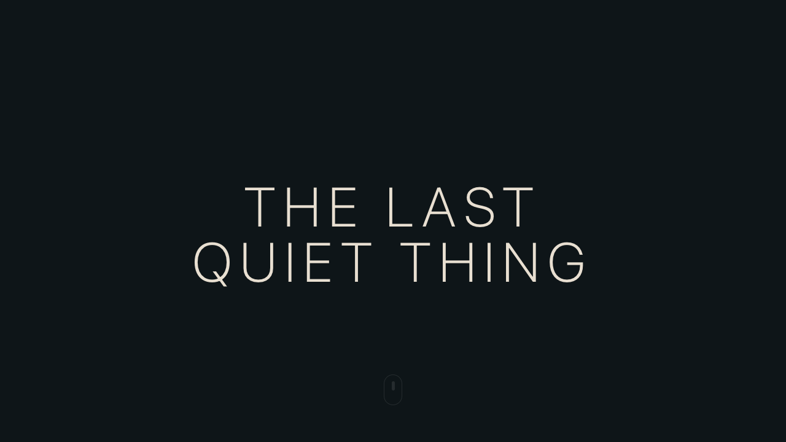
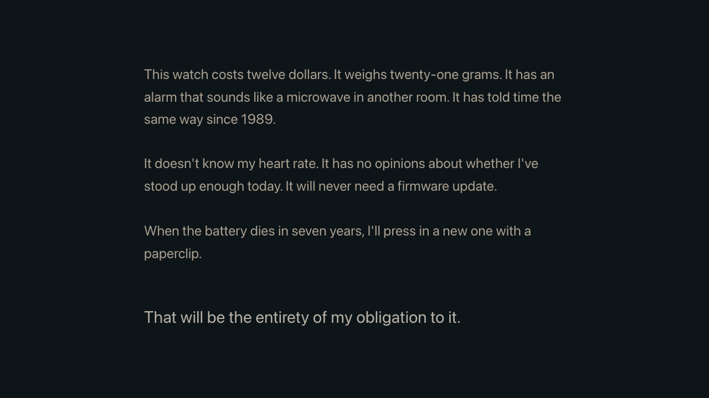
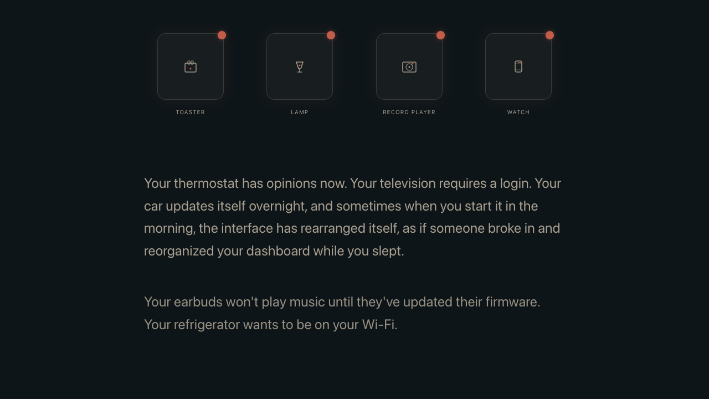
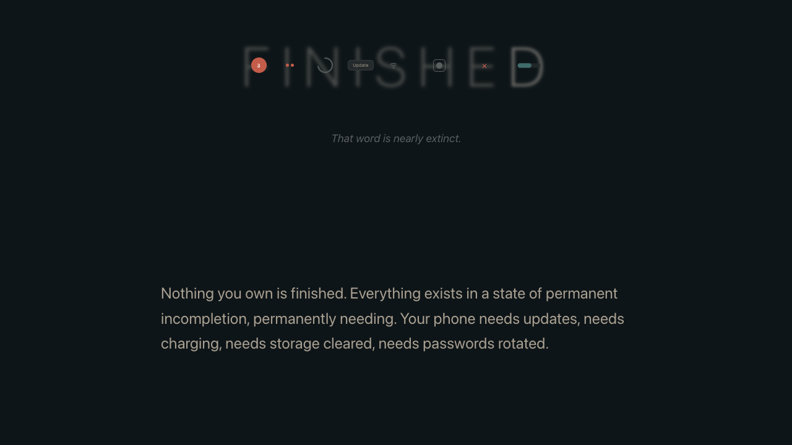
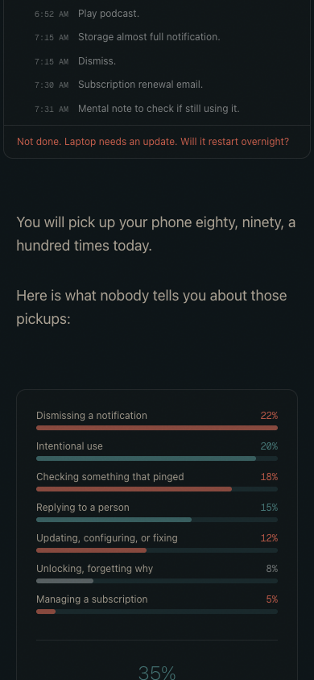

# Extract Report: Terry Godier Scroll Reveal Nugget

## 1. Extract Summary

This page makes simple article blocks feel unusually satisfying by using a small, consistent scroll reveal primitive. Most text and object blocks begin just below their final position at opacity 0, then interpolate into place as they enter the viewport. The motion is not a delayed one-shot animation; it is tied to measured viewport progress, eased, and applied to each wrapper independently.

The reusable nugget:

- Track each block's viewport progress from 0 to 1.
- Start revealing only after a threshold, usually `0.15`.
- Map the active range over roughly `0.15` progress units.
- Ease progress with `1 - (1 - t)^3`.
- Apply opacity plus a small transform: usually `translateY(24px)` to `0`, or scale `0.95` to `1`.
- Keep transition short: `opacity 0.5s ease-out, transform 0.5s ease-out`.
- Release `will-change` once active enough to avoid keeping many layers promoted.

## 2. Source And Limits

- Source: `https://www.terrygodier.com/the-last-quiet-thing`
- Original URL included email campaign UTM parameters; canonical source path above is used for durable reference.
- Capture date: 2026-05-01
- Desktop viewport: 1280 x 720.
- Mobile viewport: 390 x 844.
- Capture tools: Playwright CLI, browser snapshots, screenshots, video recordings, DOM evaluation, JS chunk inspection, CSS/network inspection.
- Scope: scroll-into-viewport animation orchestration only, not full article extraction.
- Console limits: two 404 font errors were observed for `dseg14-bold.woff2` and `dseg7-bold.woff2`; the article still rendered.
- Source-code limit: implementation was inspected from built/minified JS chunks, not the author's original source files.
- Copyright limit: article copy is summarized; reusable recipes do not copy prose or assets.

## 3. Captured Moments

| Moment | Category | Media | Why It Matters | Confidence |
| --- | --- | --- | --- | --- |
| M1 | scroll-navigation |  | Shows repeated paragraph blocks easing into visibility as they enter the viewport. | high |
| M2 | motion-choreography |  | Shows section pacing: divider, heading, and paragraphs reveal as separate beats. | high |
| M3 | motion-choreography |  | Shows the base reveal rhythm supporting a special graphic beat. | medium |
| M4 | performance-responsiveness |  | Shows the reveal pattern continuing on mobile with a simplified noise layer. | medium |

Still frames:

- 
- 
- 
- 
- 

## 4. Category Catalogue Findings

| Category | Finding | Evidence | Confidence |
| --- | --- | --- | --- |
| scroll-navigation | Article blocks reveal according to viewport progress, not just binary intersection. | E1, E2, E5, M1 | high |
| motion-choreography | The dominant reveal primitive is opacity plus a small transform over 0.5s ease-out. | E2, E3, M1 | high |
| layout-grid-composition | The effect works because content is spaced in generous vertical bands, letting each reveal breathe. | E5, E6, M1, M2 | high |
| typography | Text blocks use subdued warm-gray body copy and brighter emphasis lines, so motion can stay subtle. | E6, M1 | medium |
| performance-responsiveness | The grain layer adapts: desktop uses a fixed canvas, mobile uses a static SVG noise overlay; reveal wrappers persist on mobile. | E7, E8, M4 | medium |
| reusable-principles | The strongest pattern is a calm viewport-progress reveal system for editorial pages. | E1-E8 | high |

## 5. Evidence Table

| Evidence Ref | Method | Source URL/Path/Text Ref | Capture Context | Captured At | Media Path | Observation | What It Proves | What It Does Not Prove | Confidence |
| --- | --- | --- | --- | --- | --- | --- | --- | --- | --- |
| E1 | js-derived | `/_next/static/chunks/c7daaef848dc8762.js` | Minified JS chunk inspection | 2026-05-01 | not available | A reveal helper computes element progress from `getBoundingClientRect()`, `window.innerHeight`, and a scroll listener. | Reveal is viewport-progress driven. | Original source component names are not verified. | high |
| E2 | js-derived | `/_next/static/chunks/c7daaef848dc8762.js` | Minified JS chunk inspection | 2026-05-01 | not available | The reveal helper uses threshold `.15`, active range `.15`, ease `1 - Math.pow(1 - t, 3)`, default direction `up`, and transform offsets of 24px or scale `.95`. | Core motion math and values are verified from built JS. | Does not prove all custom sections use only this helper. | high |
| E3 | dom-derived | Runtime DOM styles | Desktop at `scrollY: 0` and `scrollY: 1560` | 2026-05-01 | not available | Hidden article wrappers have `opacity: 0`, `translate(0px, 24px)`, `transition: opacity 0.5s ease-out, transform 0.5s ease-out`, and `will-change: opacity, transform`; revealed wrappers settle at opacity 1, translate 0, and `will-change: auto`. | Initial, active, and settled states are measurable in the DOM. | Does not prove exact frame timing beyond CSS. | high |
| E4 | recording-observed | `https://www.terrygodier.com/the-last-quiet-thing` | Desktop scroll from hero to body | 2026-05-01 | `media/moments/terrygodier-last-quiet-thing-scroll-reveal/paragraph-reveal-scroll.webm` | Paragraph blocks enter one after another as scrolling brings them into view. | The effect creates readable scroll rhythm. | Does not isolate JS math on its own. | high |
| E5 | dom-derived | Runtime DOM measurement | Desktop after scroll to 1560 | 2026-05-01 | not available | One near-bottom paragraph wrapper measured opacity about `0.769755` and transform about `translateY(14.7px)`, while earlier wrappers were fully settled. | The reveal supports partial progress states, not just hidden/visible. | Does not prove user-perceived duration under all scroll speeds. | high |
| E6 | screenshot-observed | Desktop stills | Desktop article sections | 2026-05-01 | `media/stills/terrygodier-last-quiet-thing-scroll-reveal/first-paragraphs-revealed-desktop.png` | Revealed text sits in a narrow centered column with large vertical gaps and low-contrast warm-gray copy. | Layout spacing supports the motion feeling calm. | Does not prove exact typeface source beyond runtime font classes. | medium |
| E7 | js-derived | `/_next/static/chunks/c7daaef848dc8762.js` | Minified JS chunk inspection | 2026-05-01 | not available | Grain/noise component checks mobile width and `prefers-reduced-motion`; desktop uses animated canvas, while mobile or reduced motion uses static SVG noise or nothing. | Decorative motion is adapted for performance/accessibility. | Does not prove reveal wrappers disable under reduced motion. | medium |
| E8 | browser-observed | Mobile 390 x 844 | Mobile scroll and runtime eval | 2026-05-01 | `media/moments/terrygodier-last-quiet-thing-scroll-reveal/mobile-paragraph-reveal.webm` | Mobile keeps reveal wrappers, has no fixed canvas, and uses a fixed SVG noise layer. | The article preserves scroll reveal on mobile while simplifying decoration. | Does not prove physical touch inertia. | medium |
| E9 | network-derived | Browser requests | Desktop first load | 2026-05-01 | not available | Page loads Next.js chunks and two requested digital-display fonts returned 404. | Missing fonts are a real runtime artifact. | Does not prove whether fallback typography is intended. | medium |

## 6. Interaction And Sensory Decomposition

| Interaction | Trigger | User Intent | Pre-State | Feedback | Transition | Settled State | Edge States | Feel | Evidence | Confidence |
| --- | --- | --- | --- | --- | --- | --- | --- | --- | --- | --- |
| Body block reveal | Scroll a hidden block toward viewport | Continue reading | Wrapper below viewport or entering lower viewport, opacity 0, translated 24px down | Text becomes visible and moves upward into position | Progress range starts after threshold `.15`; eased with cubic-out math; CSS transition 0.5s ease-out | Opacity 1, transform 0, `will-change: auto` | Fast scroll can skip the delicate in-between but still lands settled | Calm, smooth, low-friction; it makes reading feel paced | E1-E5, M1 | high |
| Section reveal sequence | Scroll into a new section | Receive a new chapter/idea | Divider, heading, and paragraphs begin as separate wrappers | Each appears as its own beat when it reaches the trigger zone | Same primitive per wrapper; perceived stagger comes from vertical spacing rather than hard-coded delay | Section heading and lead copy are readable and stable | If vertical spacing collapses, rhythm would become noisy | Editorial and deliberate; the page pauses between ideas | E3, E4, M2 | high |
| Graphic emphasis reveal | Scroll into a special visual block | Encounter a designed punctuation point | Graphic block starts outside the reading flow or partially hidden | Large type/icon composition appears while the next paragraph keeps base reveal behavior | Mixed base reveal plus internal progress ranges for graphic details | Graphic rests as an attention reset before body copy resumes | Internal sequencing not fully mapped | Quietly theatrical; adds meaning without loud motion | E1, E2, M3 | medium |
| Mobile reveal | Scroll with narrow viewport | Read comfortably on mobile | Same article content reflowed to mobile width | Blocks reveal with the same motion; decorative noise is static | 0.5s ease-out reveal persists; canvas decoration removed | Text settles in readable mobile column | Physical touch testing not performed | Maintains the same calm rhythm without extra visual load | E7, E8, M4 | medium |

## 7. Aesthetic Rationale

The effect works because it is small and repeated. The page does not ask every block to perform; it lets each block arrive. The 24px vertical distance is enough to feel like a soft lift, but not enough to feel like a slide transition. The 0.5s ease-out gives a quick catch-up after scroll movement, so the content feels responsive rather than sluggish.

The orchestration is especially good because the stagger is spatial, not decorative. Blocks are spaced far enough apart that each reveal happens when the reader is ready for the next thought. That is why the page feels simple but polished: the animation is subordinate to pacing.

The cubic-out progress curve adds the satisfaction. Most of the visual completion happens early, then it gently settles. That matches reading behavior: the eye gets the content quickly, while the final motion gives softness.

## 8. Technical Implementation Clues

- Built app appears to be Next.js from `_next/static/chunks` assets and RSC requests.
- Reveal wrapper function accepts `children`, `className`, `direction`, and `threshold`.
- Default `direction` is `up`; supported directions include `up`, `down`, `left`, `right`, and `scale`.
- Progress calculation uses the element rect and viewport height:
  - `progress = clamp(0, 1, (viewportHeight - (rect.top - offset)) / (viewportHeight + rect.height))`
- Reveal range maps progress with:
  - `range(progress, threshold, threshold + 0.15)`
- Easing uses:
  - `1 - Math.pow(1 - t, 3)`
- Default hidden state:
  - opacity 0
  - `translateY(24px)` for `up`
  - `scale(0.95)` for `scale`
- Settled state:
  - opacity 1
  - transform 0 or scale 1
  - `will-change: auto`
- Transition:
  - `opacity 0.5s ease-out, transform 0.5s ease-out`
- Hero title has its own staged entrance using `duration-[1500ms]`, opacity, `translateY(20px)`, and blur to zero.
- Decorative grain:
  - desktop: fixed canvas, pixelated, opacity .6, overlay blend
  - mobile/reduced motion path: static SVG noise or no canvas
- Reduced-motion caveat:
  - Reduced-motion handling was verified for decorative grain. It was not verified for the reveal wrappers.

## 9. Reusable Recipes

### R1: Calm Viewport-Progress Reveal

- Intent: make long editorial content feel paced, careful, and quietly premium.
- Anatomy: reveal wrapper around each meaningful content block; article container with generous vertical spacing; optional divider/heading wrappers.
- State model: pre-entry, partial-entry, settled, offscreen-past; optional reduced-motion state.
- Interaction model: scroll event reads wrapper position, maps viewport progress to active reveal progress, updates opacity and transform.
- Motion tokens: 24px vertical offset; 0.95 scale for dividers/graphic separators; 0.5s ease-out transition; threshold 0.15; active range 0.15; cubic-out progress.
- Sensory notes: content should arrive softly and quickly; avoid bounce, overshoot, or long delays for body copy.
- Responsive rules: keep the same small distance on mobile or reduce it to 12-18px; simplify decorative layers.
- Accessibility: under `prefers-reduced-motion`, set opacity to 1 and transform to none, or shorten transition to near-zero; keep content in normal DOM order.
- Failure modes: over-wrapping every inline phrase, large translate distances, long delays, reveal before content is near reading position, leaving `will-change` on for every block.

### R2: Spatial Stagger Instead Of Timer Stagger

- Intent: sequence an article without artificial delay.
- Anatomy: separate wrappers for divider, heading, lead sentence, body paragraphs, visual blocks.
- State model: each block owns its own progress; no global timeline is required.
- Interaction model: the reader's scroll creates the stagger because blocks occupy different vertical positions.
- Motion tokens: same as R1; vary direction only for special blocks.
- Sensory notes: feels calm because the reader controls tempo.
- Responsive rules: preserve vertical breathing room, but reduce excessive gaps on small screens.
- Accessibility: content remains readable without JS if wrappers render visible by default or hydrate quickly.
- Failure modes: time-delayed cascades that make the reader wait; simultaneous reveals from cramped spacing.

### R3: One Special Visual Beat Per Section

- Intent: punctuate a text-heavy page without making every block flashy.
- Anatomy: ordinary paragraph reveals, plus occasional graphic block with internal progress ranges.
- State model: graphic container reveal, internal icon/row/text reveal, return to normal body reveal.
- Interaction model: scroll progress drives nested pieces in small ranges.
- Motion tokens: base 0.5s reveal; nested rows can use 0.3-0.5s opacity/transform ranges.
- Sensory notes: the special beat should reset attention, not dominate the article.
- Responsive rules: simplify or stack graphic elements on mobile.
- Accessibility: ensure the graphic's meaning is reflected in surrounding text or accessible labels.
- Failure modes: too many special beats, inaccessible graphic text, internal animation that obscures reading.

## 10. Reuse Readiness Gate

| Recipe | Status | Can Another Agent Recreate It Without Reopening Source? | Missing Evidence / Blocker |
| --- | --- | --- | --- |
| R1 calm viewport-progress reveal | pass | yes | Add reduced-motion variant in implementation. |
| R2 spatial stagger instead of timer stagger | pass | yes | Requires editorial spacing discipline, not more source evidence. |
| R3 one special visual beat per section | needs-work | partial | Internal graphic sequencing was only partially mapped; recipe is directional rather than exact. |

## 11. Knowledge Nodes

- `terrygodier-last-quiet-thing-source`: `knowledge/sources/terrygodier-last-quiet-thing-scroll-reveal/source.md`
- `viewport-progress-reveal-wrapper`: `knowledge/findings/scroll-navigation/viewport-progress-reveal-wrapper.md`
- `soft-block-reveal-motion-token`: `knowledge/findings/motion-choreography/soft-block-reveal-motion-token.md`
- `spatial-stagger-editorial-scroll`: `knowledge/findings/layout-grid-composition/spatial-stagger-editorial-scroll.md`
- `responsive-grain-simplification`: `knowledge/findings/performance-responsiveness/responsive-grain-simplification.md`
- `calm-editorial-scroll-reveal`: `knowledge/patterns/reusable-principles/calm-editorial-scroll-reveal.md`

## 12. Brain Links

- `terrygodier-last-quiet-thing-source` -> all new findings: `evidenced-by`
- `viewport-progress-reveal-wrapper` -> `soft-block-reveal-motion-token`: `supports`
- `spatial-stagger-editorial-scroll` -> `calm-editorial-scroll-reveal`: `supports`
- `soft-block-reveal-motion-token` -> `calm-editorial-scroll-reveal`: `supports`
- `responsive-grain-simplification` -> `calm-editorial-scroll-reveal`: `refines`
- `calm-editorial-scroll-reveal` -> `sequential-project-detail-loop`: `refines`

## 13. Open Questions

- Does the author intend reveal wrappers to respect `prefers-reduced-motion`, or only the decorative grain layer?
- Are the missing digital-display fonts expected, or is fallback rendering changing the intended watch graphics?
- What are the original component names? Built JS confirms behavior, but original source names are not available.
