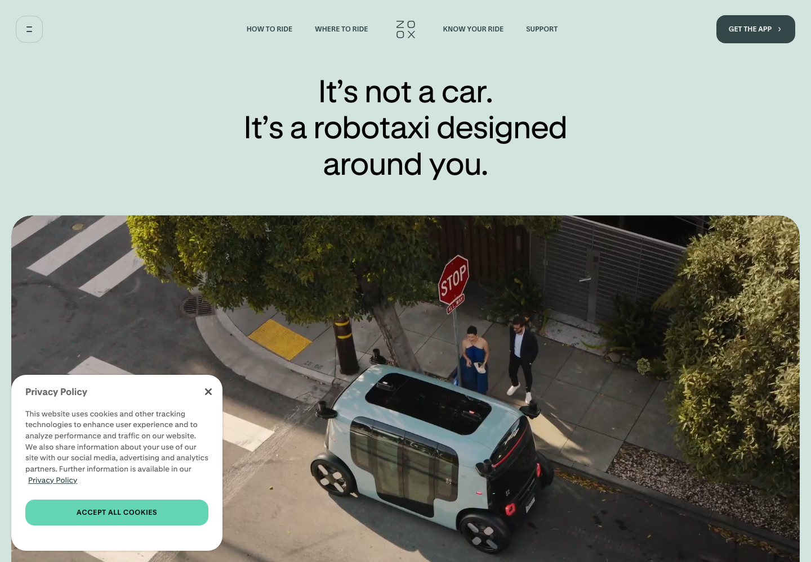

# Extract Report: Zoox Autonomy Product Storytelling

## 1. Extract Summary

Zoox uses a clear category reframe before product proof: a centered "not a car" statement, calm pale background, restrained nav, and a large rounded media window showing the robotaxi in a real street context.

## 2. Source And Limits

- Source: https://zoox.com/
- Source type: website
- Limits: Desktop/mobile stills and metadata captured. Video timing, deeper scroll states, and full cookie-state variations were not deeply inspected.

## 3. Captured Moments

| Moment | Category | Media | Why It Matters | Confidence |
| --- | --- | --- | --- | --- |
| M1 | media-handling |  | Shows category-reframe headline and rounded real-world media proof. | high |

## 4. Category Catalogue Findings

| Category | Finding | Evidence | Confidence |
| --- | --- | --- | --- |
| typography | The headline corrects the category in plain language before feature detail. | E1 | high |
| media-handling | Rounded media window shows the product in a rider-service context. | E1 | high |
| performance-responsiveness | Cookie notice can obscure the media lower-left in fresh sessions. | E1 | medium |

## 5. Evidence Table

| Evidence Ref | Method | Source URL/Path/Text Ref | Capture Context | Captured At | Media Path | Observation | What It Proves | What It Does Not Prove | Confidence |
| --- | --- | --- | --- | --- | --- | --- | --- | --- | --- |
| E1 | screenshot-observed | https://zoox.com/ | Desktop first viewport | 2026-05-02 | media/stills/zoox-autonomy-product-storytelling/home-desktop.png | Category-reframe headline over rounded media window. | Core hero pattern. | Video timing. | high |
| E2 | screenshot-observed | full-page crop | Desktop lower section | 2026-05-02 | media/stills/zoox-autonomy-product-storytelling/feature-section-desktop.png | Additional product/service sections appear below. | Story continuation. | Full section sequence. | medium |
| E3 | screenshot-observed | mobile capture | Mobile 390x844 | 2026-05-02 | media/stills/zoox-autonomy-product-storytelling/mobile-home.png | Mobile keeps the headline/media pairing. | Responsive continuity. | All breakpoints. | medium |
| E4 | text-derived | page HTML | Node fetch metadata | 2026-05-02 | not available | Metadata positions Zoox as a purpose-built autonomous vehicle for riders. | Category position. | Original component structure. | high |

## 6. Interaction And Sensory Decomposition

| Interaction | Trigger | User Intent | Pre-State | Feedback | Transition | Settled State | Edge States | Feel | Evidence | Confidence |
| --- | --- | --- | --- | --- | --- | --- | --- | --- | --- | --- |
| Category reframe | page load | Understand what Zoox is | Familiar car mental model | "Not a car" statement resets expectation | not inspected | User inspects real-world media | Cookie overlay can obscure media | calm, clear, rider-centered | E1 | high |

## 7. Aesthetic Rationale

The page makes autonomous mobility feel less intimidating by using calm color, rounded forms, and plain-language category correction.

## 8. Technical Implementation Clues

The site ships Next.js static CSS/JS chunks. Consent overlays should be captured or dismissed consistently in future extractions.

## 9. Reusable Recipes

For new categories, explain the difference before features. Use a real-world media panel immediately below the claim.

## 10. Reuse Readiness Gate

| Recipe | Status | Can Another Agent Recreate It Without Reopening Source? | Missing Evidence / Blocker |
| --- | --- | --- | --- |
| category-reframe-media-hero | pass | yes | Video timing unavailable. |

## 11. Knowledge Nodes

- zoox-autonomy-product-storytelling: knowledge/sources/zoox-autonomy-product-storytelling/source.md
- category-reframe-media-hero: knowledge/patterns/reusable-principles/category-reframe-media-hero.md

## 12. Brain Links

- zoox-autonomy-product-storytelling -> category-reframe-media-hero: example-of

## 13. Open Questions

- How does the full page sequence introduce rider flow, safety, and availability?
